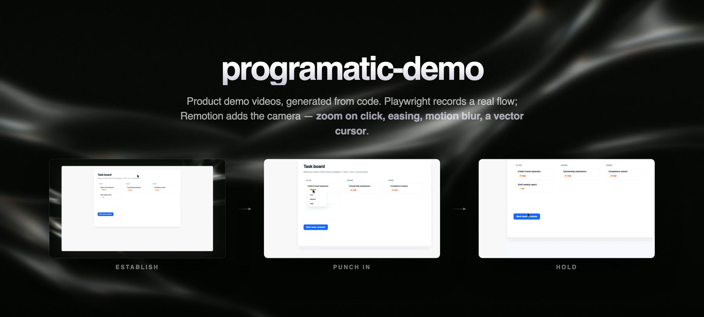
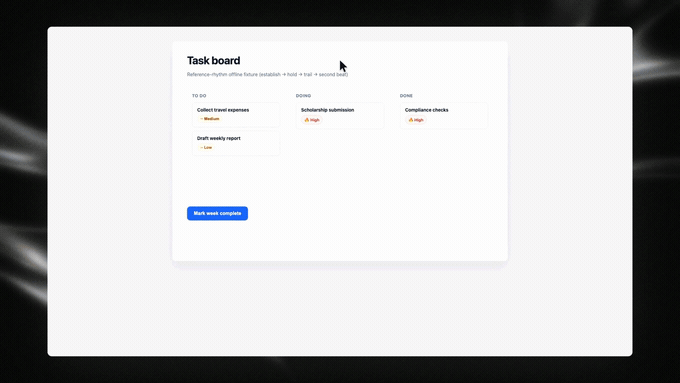

<div align="center">



# programatic-demo

**Product demo videos, generated from code.**
Playwright records a real flow through your app. Remotion adds a Screen
Studio-style camera — zoom on click, easing, motion blur, a vector cursor and a
studio frame. The result is an MP4 you can regenerate every release.

[Quick start](#quick-start) · [Writing a flow](#writing-a-flow) · [How it works](#how-it-works) · [Reference](#reference)

</div>

---

## Three things this makes

| | **demo** | **reel** | **still** |
| --- | --- | --- | --- |
| What | one recorded flow, played through | a launch film cut from cards + demo footage | one region of the app, as an image |
| You write | `flows/<name>.ts` | `reels/<name>.ts` | `shots/<name>.ts` |
| You run | `pnpm record:live` → `convert` → `render` | `pnpm reel <name>` | `pnpm still <name>` |
| You get | `out/demo/<name>.mp4` | `out/reel/<name>.mp4` | `out/still/<name>-<preset>.png` |

A reel is cut **from** a demo, so render the demo first. A still stands alone —
it drives the app itself and never touches the video pipeline. It is also the
only one that can be 4K, for a reason worth knowing: see
[Stills](#stills-one-part-of-the-app-at-4k).

## Why

Screen recordings go stale. Someone re-records them by hand, the mouse wanders,
the zoom is wrong, and six months later the UI has moved on.

Here a demo is **source code**. You describe the beats; the pipeline shoots it:

```ts
export default defineFlow({
  name: "agent-instructions",
  viewport: { width: 1920, height: 1080 },
  startUrl: process.env.DEMO_URL_AGENT_INSTRUCTIONS,
  steps: [
    { pause: 700 },
    { click: "AGENTS.md", cluster: "file", after: 1400 },
    { hoist: "Save" },
    { type: "editor", text: INSTRUCTIONS, cluster: "write", after: 600 },
    { click: "Save", cluster: "save", after: 900 },
  ],
});
```

No selector file, no keyframes, no timeline. The camera work is derived from
where you clicked and when.

<p align="center">
  
</p>

## Requirements

| | |
| --- | --- |
| Node | 20+ |
| pnpm | 9+ |
| ffmpeg | **system install required** (`brew install ffmpeg`) — see [Sync](#sync-why-the-recorder-flashes-the-screen) |
| GPU | rendering rasterises on the GPU, worth **roughly 10×** on a real demo (a 23s clip: 24 min → 2-3 min). No usable GPU (CI, headless Linux)? Set `DEMO_GL=swiftshader` — see [Knobs](#knobs) |

## Quick start

```bash
pnpm install
pnpm exec playwright install chromium
```

Then prove the whole pipeline offline, with no network and no login:

```bash
pnpm clip:smoke
```

That records a local fixture, converts it, renders it, and writes
`out/demo/smoke.mp4`. If it works, record → convert → render all work.

```bash
pnpm test     # camera / track unit tests
pnpm studio   # open Remotion Studio and scrub the zooms
```

Two more demos run against public sites, no auth:

```bash
pnpm clip:google     # DuckDuckGo HTML (automation-friendly)
pnpm clip:skillsmp   # skillsmp.com search flow
```

## Recording your own app

Copy `.env.example` to `.env` and point it at your app. For a site behind a
login, sign in once — the session is reused for every later shoot:

```bash
pnpm capture:session
```

Then write `flows/<name>.ts` (see below) and shoot it:

```bash
pnpm record:live <name>
pnpm convert <name>
pnpm render <name>
```

Recording is **headless by default**. That is not only about the distraction: a
window that loses focus blurs inputs, pauses animations and flips
`:focus-visible`, so a visible window was a variable in the take. Set `HEADED=1`
to watch a flow fail. `capture:session` is always headed — you cannot type a
password into a window you cannot see.

### Several at once

```bash
pnpm record:batch --all --concurrency 2
pnpm record:batch a b --check      # resolve selectors only, no video
```

`.session-profile/` can only be held by one browser at a time, which is why
shoots used to be serial. The batch does the one step that needs the profile —
proving the session is live and re-exporting `storageState.json` — **serially up
front**, then fans out into isolated contexts that share nothing.

Two things to know before leaning on it:

- **Concurrency is bound by memory, not cores.** Each worker is a whole Chromium
  plus an encoder. 3 is comfortable on 16GB; a past run with 8 started
  OOM-killing renders.
- **Cold contexts are slower than the warm profile.** Anything that waits a fixed
  number of milliseconds for the app to render can fall through. Wait for
  elements (`findByName`), don't probe after a sleep (`softByName`).

Flows that write the same app state must not overlap — declare it with
`mutates`, and flows sharing a key run in one serial lane.

## Writing a flow

A demo is a list of steps. Each entry is one line of the script, with its beat
beside it rather than interleaved between statements.

| Step | Does |
| --- | --- |
| `{ click }` / `{ type, text }` / `{ focus }` / `{ moveTo }` | the matching `ctx` helper |
| `{ pause: ms }` | hold still — the opening establish beat is just this, first |
| `{ hoist: name }` | resolve a name now, reuse it later |
| `{ do: async (ctx) => … }` | escape hatch: conditionals, nav waits, retries |

Any acting step also takes `label`, `cluster`, `zoom`, `frame` and `after` (the
beat that follows it). `defineFlow` compiles the list into the same `run`
function a hand-written flow provides, so `run:` is still available for flows the
list cannot express — `google-search` and `skillsmp-search` use it.

### Naming targets

A flow addresses elements by the name a viewer would read off the screen. There
is no per-demo selector file to write:

```ts
await moveAndClick("AGENTS.md");            // the row whose label reads AGENTS.md
await typeInto("Search", "deepseek v4");    // the field labelled Search
```

`autoCandidates` ([`scripts/lib/selectors.ts`](scripts/lib/selectors.ts)) turns
the name into an ordered ladder — exact accessible-name matches on real controls
first, then label, placeholder, test id, "control containing this text", and bare
text last. Every run logs which rung won, so an app change shows up as the ladder
degrading:

```
✓ AGENTS.md via control containing "AGENTS.md"
✓ Save via role=button name="Save"
```

Two escape hatches, for what a name cannot express:

| Case | Use |
| --- | --- |
| No accessible name at all, or one name matching several things | `targets` on the flow — a map of name → candidates |
| A layout anchor nobody would say out loud | `css("#title")` |

Resolution is inline and normally costs a few ms. It is only expensive when the
element has not rendered yet, because then it blocks — and a block during a still
beat reads as dead air. Hoist those with `{ hoist: name }` during a beat where
something else is already moving. Doing it after a typing beat once turned a
0.7 s breath into a 1.9 s hole.

## Intro title card

An optional card that plays before a demo: wordmark, headline assembling word by
word, then a still hold. It is rendered as its own composition and concatenated
onto the demo, so nothing about the demo render changes.

Write the copy — that is the whole storyboard, there is no animation to author.
Author it as **JSON** (no code) or **TS** (`intros/<name>.json` is loaded before
`intros/<name>.ts`):

```json
// intros/agent-skill.json  — name must match the demo
{
  "name": "agent-skill",
  "headline": "Give your agent a *new skill*",
  "subhead": "In under a minute.",
  "wordmark": "Acme"
}
```

```ts
// intros/<name>.ts — same fields, if you prefer code
import { defineIntro } from "../src/lib/intro";

export default defineIntro({
  name: "agent-skill",              // must match the demo name
  headline: "Give your agent a *new skill*",
  subhead: "In under a minute.",    // optional
  wordmark: "Acme",                 // optional
});
```

**Emphasis is per-word and lives inside the headline string** — headlines are
normal weight by default, and any word can opt into a style with inline markup,
no code change:

| Markup | Effect |
| --- | --- |
| `*word*` | **bold** |
| `_word_` | _italic_ |
| `==word==` | highlight in the palette colour |
| `==word\|#ffd54a==` | highlight in a custom colour (ink auto-contrasts) |
| `{chip}` | the live control (chip cards) — styling composes around it |

A marked run may span words (`*two words*`); each word still appears on its own
beat. `introProblem` validates the markup (a malformed `#hex`, a chip line too
long once the markup is stripped) before a frame renders.

Then, after the demo itself has been rendered:

```bash
pnpm clip <name>     # record -> convert -> render   (unchanged)
pnpm intro <name>    # render:intro -> stitch
```

| Command | Writes |
| --- | --- |
| `pnpm render:intro <name>` | `out/reel/<name>.intro.mp4` |
| `pnpm stitch <name>` | `out/reel/<name>.full.mp4` — the card + the demo |
| `pnpm intro <name>` | both of the above |

Pacing comes from the word count, in
[`src/lib/intro.ts`](src/lib/intro.ts): words start 90 ms apart and overlap, so
a headline assembles as one phrase. Keep headlines to 4–7 words. Unlike the demo
body, the card does **not** speed up under `DEMO_SPEED` — the footage is a
recording being replayed faster, the card is authored motion, and copy at 2x is
copy nobody reads.

The card uses the same studio backdrop the demo floats its window on, so
the cut lands on an unchanged frame: the text leaves, the window arrives. That
is also why the two halves must agree on geometry exactly —
[`pnpm stitch`](scripts/stitch.ts) joins them with `-c copy`, and it probes both
files and refuses rather than producing an mp4 that plays and then falls apart.

**`pnpm analyze` works on a stitched or reel file too, now.** It used to be
useless there — a title card was a long frozen run by design and tripped the
dead-air thresholds. Cards no longer freeze, and the reel passes all six checks
(0.7% frozen against a 15% ceiling). `out/demo/<name>.mp4` is still never touched, so
analyze also keeps measuring the demo alone.

## Reels: cards cut with the demo

A reel is the narrative cut — title cards interleaved with ranges of an
already-rendered demo, in the style of a product launch film. The cards narrate,
the clips prove.

```ts
// reels/<name>.ts
import { defineReel } from "../src/lib/reel";

export default defineReel({
  name: "agent-skill",
  segments: [
    { card: { name: "agent-skill", headline: "Introducing Skills",
              wordmark: "Acme", background: "plain" } },
    { clip: { fromS: 0, toS: 3.2, label: "open the drawer" } },
    { card: { name: "agent-skill", headline: "Name it. Say when to use it.",
              background: "plain", holdS: 0.5 } },
    { clip: { fromS: 3.2, toS: 7.9, label: "name and describe" } },
  ],
});
```

```bash
pnpm render <name>   # the demo itself, once
pnpm reel <name>     # -> out/reel/<name>.mp4
```

Clip ranges are **seconds of `out/demo/<name>.mp4`** — the numbers you read off a
scrubber. `toS` is exclusive, so `0 → 3.2` and `3.2 → 7.9` do not share a frame.
Cut on still beats, not mid-glide: the camera holds through every interaction,
and a cut during a pan reads as a mistake.

Clips are re-rendered from the `DemoClip` composition with `--frames` rather
than cut out of the mp4, so the footage never picks up a second h264 generation.
That would make every iteration cost a full render, so each segment is cached
under `.diag/reel/<name>/` keyed by a hash of its own spec — change one card's
copy and only that card re-renders.

**Match the card's ground to the product.** `background` takes `"light"` (flat
near-white), `"plain"` (flat near-black) or `"plate"` (the default —
the studio backdrop, the same image the demo floats its window on, so a card at
the very start or end joins the footage on an unchanged frame).

Pick it by measuring, not by taste. The app these numbers come from is
light-theme and its footage averages Y 181; against near-black cards every cut
was a ~157-level slam, where the reference ad we benchmark against averages 63.
Switching to `"light"` put every cut at 42. For a dark-theme product the answer
inverts.

**A cold open** is a short clip in first position followed immediately by a card
— a few frames of product before anything is claimed about it. That shape is
recognised, so it is exempt from the rule that clip ranges move forward, and it
can replay footage a later clip covers. Pick a range where something is already
moving; opening on a static establish shot reads as a stuck decoder.

**`drift: 1` on a clip** adds a slow push inside its long holds, so a multi-second
typing beat is not perfectly inert. Off by default and never applied to
`out/demo/<name>.mp4`, so `pnpm render` and `pnpm analyze` are unaffected.

**A chip card** puts a live-looking control inside the sentence, sends the cursor
to it, and punches the camera into it — the click becomes the cut. Write
`headline: "Hit {chip}. It's live."` with `chip: { label: "Create" }`. The
sentence must fit one line; the chip is centred by a `1fr auto 1fr` grid so the
camera never has to measure where it landed.

Writing the copy: one short line per card, 4–7 words, saying what the next clip
is about to show. Pacing is derived from the word count — there is nothing to
time by hand. Give interstitials a short `holdS` (~0.5s); the 1.2s default is a
title-card hold and reads as a stall mid-film.

## Stills: one part of the app, at 4K

Demos are video, and video from this pipeline can never be 4K — Playwright's
screencast emits CSS-viewport pixels no matter what you ask it for. A
**screenshot** is different: it reads the real compositor surface, so at a
1920×1080 viewport with `deviceScaleFactor: 2` it really is 3840×2160.

That is what a still is: a captured region of the app, framed on the same
backdrop and in the same window as the clips, sized for wherever you are posting
it.

```bash
pnpm still smoke                # capture + frame, 3840×2160
pnpm still smoke og             # a 1200×630-shaped link card, at 2×
pnpm still smoke --all          # every preset
```

A shot is authored like a flow, because the hard part is getting the app into
the state worth photographing — not the photograph:

```ts
// shots/agent-skill.ts
import { css } from "../scripts/lib/flow";
import { defineShot } from "../scripts/lib/shot";

export default defineShot({
  name: "agent-skill",
  viewport: { width: 1920, height: 1080 },
  startUrl: process.env.DEMO_URL_AGENT_SKILL,
  steps: [
    { click: "Skills" },
    { click: "Add skill", after: 800 },
  ],
  region: css("[data-panel=skills]"),   // the part to keep
  padding: 24,
});
```

`region` takes three forms. A **visible name** goes through the same ladder
clicks use, so `region: "Save"` finds the Save button — but that ladder resolves
*controls*, and most interesting regions (a sidebar, a results panel) have no
accessible name, so **`css(...)`** is the usual answer. An explicit
**`{ x, y, w, h }`** covers the rest. To pick one by eye:

```bash
pnpm shot smoke --probe
```

which drives the steps and then writes `.diag/shots/<name>.probe.png` — the full
viewport under a 100px coordinate grid — plus a listing of what was on screen.
Read the numbers off it and paste them in as a rect.

### Backdrops

Sixteen ship with the repo. Pick one by name — no code change:

```ts
export default defineShot({ name: "triggers", backdrop: "cobalt", /* … */ });
export default defineFlow({ name: "agent-skill", backdrop: "prism", /* … */ });
```

| name | | | name | |
| --- | --- | --- | --- | --- |
| `glaze` | near-black, faint streaks — default | | `halo` | magenta ring on near-black |
| `ink` | the darkest — filaments on black | | `dusk` | a low sunset horizon |
| `cobalt` | blue and magenta folds | | `studio` | a studio-lit object |
| `graphite` | monochrome folds, most neutral | | `canyon` | **light** — cream and teal |
| `ember` | red folds, deep | | `mist` | **light** — pale teal and white |
| `flare` | red folds, brighter | | `chalk` | **light** — near-white, grey ring |
| `prism` | teal and coral split | | `aurora` | **light** — cyan to lavender |
| `bloom` | soft pink and white | | `moonrise` | deep purple, magenta glow |

`dusk` and `studio` have a recognisable subject rather than being abstract, so
check the window is not sitting on the horizon or the object.

Override at render time without re-recording:

```bash
pnpm render:still triggers wide --backdrop=ember
pnpm render agent-skill --backdrop=graphite
```

Add your own — any image, converted and prepared the same way:

```bash
pnpm backdrop ~/Pictures/wall.heic aurora
```

That scales, blurs, grains and reports the banding measurement. Grain is not
decoration: h264's deadzone quantiser turns a smooth ramp into rings unless the
grain is in the source at full amplitude, and weak grain measures *worse* than
none. All sixteen measure 4–12px as the longest identical-colour run on a
scanline; the CSS gradient they replaced measured 97, a flat colour 2560.

On a **light** backdrop the window's white rim has nothing to be brighter than,
so it switches to a soft dark shadow instead. `LIGHT_BACKDROPS` holds every
backdrop measuring YAVG > 110 — add yours there if it is bright.

### Presets

| Preset | Canvas | For |
| --- | --- | --- |
| `wide` | 3840×2160 | 16:9 — the default, matches the demo videos |
| `og` | 2400×1260 | X / LinkedIn / OpenGraph link cards (2× the canonical 1200×630) |
| `square` | 2160×2160 | 1:1 feed posts |
| `portrait` | 2160×2700 | 4:5 — the tallest an Instagram feed post may be |
| `story` | 2160×3840 | 9:16 — stories, Reels, Shorts |

Every preset holds its **short** edge at 2160, so the same capture carries the
same detail whichever frame it lands in. The window takes the region's own
shape and is fitted into the canvas on whichever axis binds first, so a wide
region in a 9:16 frame letterboxes rather than being cropped.

### Already have the screenshot?

```bash
pnpm render:still <name> --from screenshot.png --all
```

Skips the capture and frames an image you already have. The sidecar is written
from the file's real dimensions, so the upscale warning stays honest — a
2832px-wide screenshot in a 3840px canvas is stretched about 1.1x. Shoot it with
`pnpm shot` instead when you want native pixels.

### Resolution

`deviceScaleFactor` can only be set when the browser context is created, so the
capture runs once at 2×, measures what the region actually came out to, and
re-runs at a higher factor if it fell short. Set `scale` in the spec once a shot
is settled to skip the second pass. If a region is too small to reach 4K even at
4× — anything under about 960 CSS px — you get a warning saying so rather than a
quietly upscaled image.

## How it works

```
 flows/<name>.ts
        │
        ▼
 Playwright  ──►  recordings/<name>.webm   +   public/<name>.clicks.json
   drives the app, glides a synthetic cursor, logs every click with its
   position, bounding rect, departure time and typing end
        │
        ▼
 ffmpeg      ──►  public/<name>.mp4
        │
        ▼
 Remotion    ──►  out/demo/<name>.mp4
   builds a camera track from the click log, composites it over a studio
   backdrop, draws the cursor as vector at output resolution
```

The click log is the interface between the two halves. Nothing about the camera
is authored by hand: cluster ids group clicks into beats, and
[`src/lib/zoom.ts`](src/lib/zoom.ts) turns those into a keyframe track — punch
in, hold, pan or trail out — which [`src/lib/camera.ts`](src/lib/camera.ts)
interpolates with a single measured easing curve.

### Reference rhythm

1. **Establish** ≥ 600 ms at scale 1, static
2. **Lead-in** (distance-aware) as the cursor departs
3. **Hold** ≥ 1.3 s still through the interaction
4. **Trail** (~1.25× the punch) only when the next beat needs space
5. **End** at base scale, always — then cut

### Sync: why the recorder flashes the screen

At the moment the demo clock starts, the recorder paints a full-screen magenta
frame for 160 ms and removes it. That flash is a clapperboard: the first frame
after it is the demo's first frame, so the trim point is *measured* rather than
guessed. It lands in the trimmed head and never reaches the final clip.

It exists because both ends of the recording are invisible to the driver.
Playwright will not say when the screencast actually started (it lags the context
opening) or when it stopped (it keeps capturing into browser teardown), and both
guesses shipped bugs:

| estimate | error | symptom |
| --- | --- | --- |
| `demoStart - recStart` | over-trims by capture-start lag (~0.83 s) | actions happen before their clicks |
| `videoDuration - duration` | over-trims by teardown tail (~0.46 s) | same, but intermittent |

Both put the footage ahead of the click log, so drawers opened before the pointer
arrived. **This needs a system ffmpeg** — Remotion's bundled build has no
`signalstats`. Without it the recorder falls back to the old estimate and prints
a loud warning.

### Knobs

Four env vars, all optional. Each one's reasoning and measurements live beside
the constant it controls, not here:

| Var | Default | Does | Measured in |
| --- | --- | --- | --- |
| `DEMO_GL` | `angle` | Chromium's rasteriser, and the biggest lever here — `angle` is the real GPU, worth **roughly 10×** (a 23s demo renders in 2-3 min instead of 24). `swiftshader` is the no-GPU fallback — it works everywhere, but it is software too, so expect roughly the un-accelerated time | [`scripts/render.ts`](scripts/render.ts) |
| `DEMO_SPEED` | `1.25` | Playback rate vs the shoot. `1` is realtime | [`src/lib/click-log.ts`](src/lib/click-log.ts) |
| `DEMO_PRESET` | `wide` | Default still preset, when none is given on the command line | [`src/lib/still.ts`](src/lib/still.ts) |
| `DEMO_CONCURRENCY` | Remotion's own | Frames rendered in parallel. Leave it unset — 6 workers measured 33% *slower* than the default. `1` is useful for debugging a render | [`scripts/render.ts`](scripts/render.ts) |

## Layout

| Path | Role |
| --- | --- |
| `flows/` | One file per demo. Only the generic ones are committed — see below |
| `scripts/` | Recorders, converter, renderer, analyzer |
| `scripts/lib/` | Cursor, flow helpers, selector ladder, session, batch |
| `src/lib/click-log.ts` | Shared types + all camera timing constants |
| `src/lib/camera.ts` | Pose interpolator + distance-aware durations |
| `src/lib/zoom.ts` | Keyframe track + region framing |
| `src/DemoClip.tsx` | Studio frame, backdrop, shuttered motion blur |
| `src/Intro.tsx` | Title-card composition (no motion blur) |
| `src/StillShot.tsx` | Still composition: a captured region on a preset canvas |
| `src/WindowFrame.tsx` | The floating window and its rim light, shared by both |
| `src/lib/still.ts` | Social presets + window-fit geometry |
| `shots/` | One file per still (`defineShot`) — only the example is committed |
| `src/lib/intro.ts` | Storyboard type + card timing |
| `intros/` | One title card per demo (`defineIntro`) — only the example is committed |
| `reels/` | Narrative cuts: cards + clip ranges (`defineReel`) |
| `src/lib/reel.ts` | Reel segment types + clip-range arithmetic |
| `public/backdrops/` | The studio backdrops (committed design assets) |
| `src/lib/backdrop.ts` | Backdrop names + light/dark elevation |
| `.agents/skills/` | Agent-readable pipeline docs |

**What is not committed.** `out/`, `recordings/`, `public/*.mp4`,
`public/*.clicks.json`, `public/shots/` and `tours/*.json` are all regenerated
by the pipeline.
Demo flows written against a private workspace are ignored too — they hardcode
one account's URLs, agent names and data-specific selectors, so they would not
run for anyone else. The engine is the open-source part; your demos stay yours.
`flows/smoke.ts`, `flows/google-search.ts` and `flows/skillsmp-search.ts` are
committed because they are deliberately generic. `intros/` follows the same
rule for the same reason — a title card names that account's product — with
`intros/smoke.ts` committed as the worked example, and `shots/` likewise.

## Reference

Deeper pipeline notes, including the agent-readable version:
**[`.agents/skills/remotion-demo-pipeline/SKILL.md`](.agents/skills/remotion-demo-pipeline/SKILL.md)**

Most non-obvious constants carry their measurement in a comment beside them —
why the backdrop is a baked image rather than a CSS gradient, why a soft gradient
must not live inside `CameraMotionBlur`, why the output is 2560 and not 4K. If a
number looks arbitrary, the reason is usually one scroll away.

## License

MIT — see [LICENSE](LICENSE).
